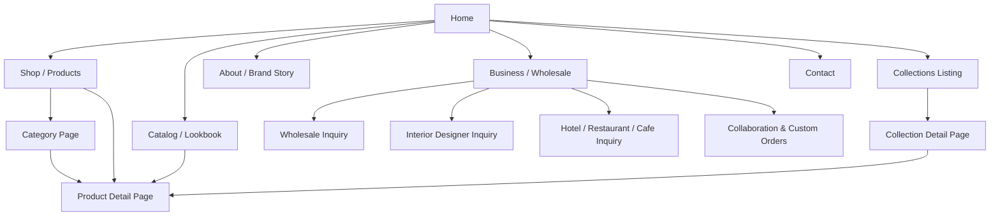
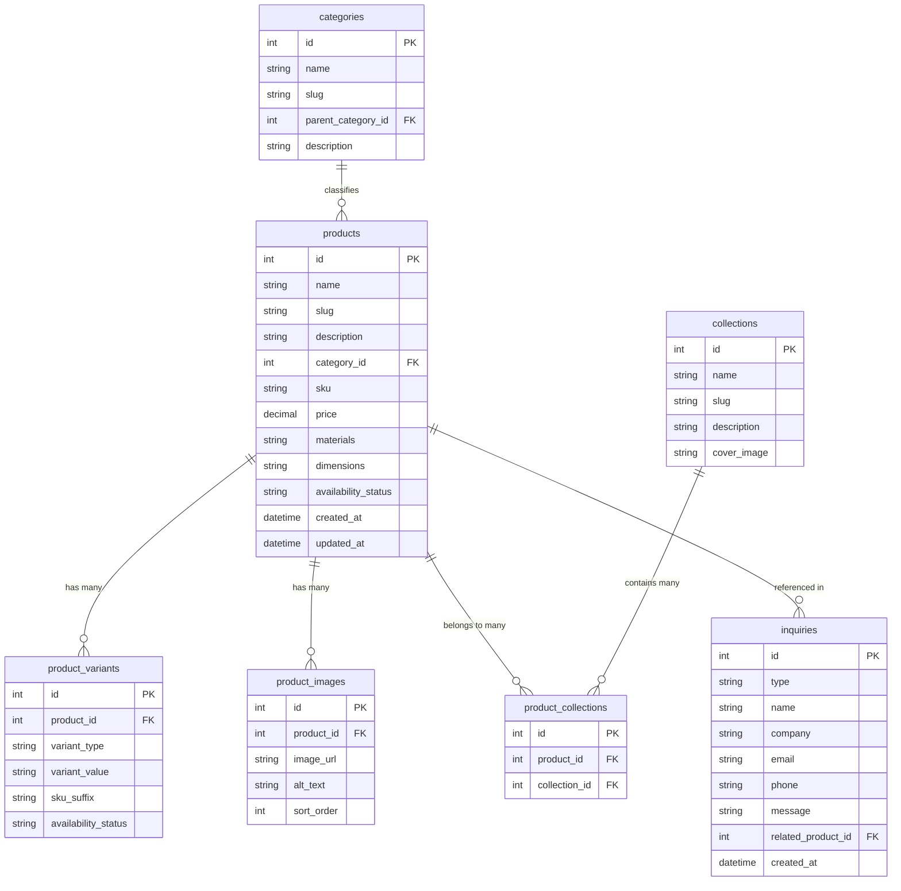

# PRD — Napak Living Website

## 1. Product Overview
Napak Living is a home decor brand focused on home decor, table accessories, and lifestyle products. This document defines the product requirements for the Napak Living website: a catalog-driven platform where retail customers, interior designers, hospitality buyers, and wholesale partners can discover products and collections, learn about the brand, and reach out for purchase, trade, or collaboration.

The site's functional structure and content organization are adapted from an analysis of **Tanteri Ceramic** (tantericeramic.com), a comparable home/tableware brand — looking only at its **functionality, page structure, and content organization**. Tanteri's branding, copy, imagery, and visual design are not carried over. All visual design, styling, typography, spacing, and UI components for Napak Living are defined separately in `design.md` and are intentionally out of scope here.

**Scope assumption:** Tanteri's site is relationship- and inquiry-driven rather than built around instant checkout, and pricing/SKU data in the sourced requirements is explicitly conditional ("if applicable"). Based on that, this PRD scopes the MVP as a **catalog + inquiry-driven website** — visitors browse and inquire; there is no in-site cart or payment checkout in v1. Full e-commerce transactions are listed under Future Expansion (Section 11) if Napak Living wants to pursue that later.

## 2. Goals
- Present Napak Living's home decor, table accessories, and lifestyle products in a clear, well-organized, browsable catalog.
- Communicate the Napak Living story, philosophy, and craftsmanship to build brand identity and trust.
- Generate qualified inquiries from retail customers, interior designers, hospitality buyers, and wholesale/business partners.
- Provide a product, category, and collection structure Napak Living can expand on its own as the catalog grows, without developer involvement for routine content changes.
- Deliver a fast, responsive, accessible experience across desktop, tablet, and mobile.
- Keep the MVP practical — no features beyond what supports the goals above.

## 3. Target Users

| User Type | Description | Primary Needs |
|---|---|---|
| Retail / Individual Customer | Everyday visitors browsing for home decor, table accessories, or lifestyle pieces | Easy browsing, clear product details, styling inspiration |
| Interior Designer / Stylist | Sources pieces for client projects | Material & dimension specs, collection groupings, a direct trade contact channel |
| Hospitality Buyer (Hotel / Restaurant / Café) | Procures decor and tableware for a venue | Specification info, bulk/wholesale inquiry, custom order option |
| Wholesale / Business Partner | Retailer or distributor considering stocking Napak Living products | Catalog/collection access, a clear wholesale inquiry path |
| Napak Living Admin | Internal team managing catalog content and incoming inquiries | Simple content management, visibility into inquiries |

## 4. Sitemap

**Primary navigation:** Home · Shop · Categories · Collections · Catalog/Lookbook · About · Business/Wholesale · Contact. Categories and Collections are exposed as dropdown/mega-menu groups under Shop rather than as flat top-level links; on mobile this collapses into a single navigation menu (see Section 10).

## 5. Pages & Requirements

### 5.1 Homepage
- **Hero:** Brand visual and headline with a primary CTA (e.g. "Shop the Collection") and a secondary CTA (e.g. "Our Story").
- **Featured Products:** Curated grid of selected/tagged products linking to their Product Detail Pages.
- **Featured Collections:** Highlights 2–4 collections, each linking to its Collection Detail Page.
- **Product Categories:** Visual entry points into the main categories (Section 5.2), each linking to a filtered catalog view.
- **Brand Introduction:** Short brand statement/tagline.
- **Brand Story Teaser:** Excerpt from the About page with a "Read More" link.
- **Promotional / Content Section (optional):** Flexible, content-managed slot for seasonal highlights or lifestyle imagery — not required on every visit, but the layout should support it.
- **Testimonials (optional):** Space for customer or trade-partner quotes.
- **Business / Wholesale CTA:** Directs designers, hospitality buyers, and wholesale partners to the Business/Wholesale page.
- **Footer:** Primary navigation, contact info (email, WhatsApp), social links, newsletter signup (optional), copyright.

### 5.2 Product Catalog (Shop)
- **Product Listing:** Paginated or load-more grid of products.
- **Category Structure:** Flexible parent/child taxonomy. Initial set:
  - Home Decor → Vases, Decorative Objects, Candle Holders
  - Table Accessories → Bowls, Trays
  - New parent or child categories can be added without redesign (e.g. future: Rugs, Lighting, Cushions).
- **Filtering:** By category, collection, material, and availability at minimum.
- **Sorting:** Newest, name (A–Z / Z–A), and price (if pricing is enabled).
- **Product Search:** Keyword search across product name, description, and SKU.
- **Product Card:** Image, name, category/collection tag, short descriptor, price (if applicable), "New" indicator when relevant.
- **Empty State:** Clear messaging when filters/search return nothing, with an option to reset.

### 5.3 Product Detail Page (PDP)
- **Image Gallery:** Multiple product images/angles.
- **Core Info:** Name, category, and collection tag(s).
- **Description:** Full product description.
- **Specifications:** Materials, dimensions, care instructions.
- **Variants:** Color/finish/size options where applicable, each with its own availability.
- **SKU / Product Code.**
- **Price & Availability** (if applicable): in stock, made-to-order, or unavailable.
- **Related Products:** Drawn from the same category and/or collection.
- **Primary CTA:** Inquiry action (e.g. "Ask About This Piece"), consistent with the inquiry-driven MVP model (Section 1).

### 5.4 Collections
- **Collection Listing Page:** Grid of all collections with cover image, name, and short description.
- **Collection Detail Page:** Collection name, full description/story, and a grid of its products, with a link back to the full catalog.
- A product may belong to several collections while keeping one primary category (Section 7).

### 5.5 Catalog / Lookbook
Napak Living's equivalent of Tanteri's gallery-style browsing experience, adapted for a home decor context:
- **Editorial Browsing:** Curated, styled imagery (e.g. room or tabletop settings) grouped by theme, room, or collection.
- **Shoppable Tags:** Images can be tagged with one or more products; selecting a tag opens that Product Detail Page.
- **Entry Points:** Reachable from primary navigation and from relevant Collection pages.
- **Trade Use (optional):** A downloadable catalog (PDF or similar) for designers, hospitality buyers, and wholesale partners, generated from the same product/collection data.

### 5.6 About / Brand Story
- **Napak Living Story:** Founding narrative and mission.
- **Brand Philosophy:** Design approach and point of view.
- **Materials & Craftsmanship:** How products are made and what they're made from.
- **Brand Values:** e.g. sustainability, local craftsmanship, quality — actual content defined by Napak Living; the page must support one or more value statements, each with a short description.

### 5.7 Business / Wholesale
- **Overview:** Short intro to Napak Living's trade/collaboration offering.
- **Inquiry Types Supported:** Wholesale, Interior Designer, Hospitality (Hotel/Restaurant/Café), Collaboration, Custom Orders — the form lets the user pick a type so inquiries route and display correctly.
- **Inquiry Form Fields:** Name, company (optional), email, phone, inquiry type, message, optional reference file/image upload.
- **Collaboration Showcase (optional):** Highlights past collaborations or custom projects, in the spirit of Tanteri's partner case studies — using only Napak Living's own projects.
- **Trade Catalog Access (optional):** Link to the downloadable catalog from Section 5.5.

### 5.8 Contact
- **Contact Info:** Email, phone/WhatsApp (click-to-chat), social media links, physical address/showroom if applicable.
- **Contact Form:** Name, email, subject/topic, message.
- **Map (optional):** Embedded map when a physical location exists.

## 6. Core Features
1. **Product Catalog & Filtering** — browse, filter, and sort products by category, collection, material, and availability.
2. **Product Search** — keyword search across the catalog.
3. **Category Taxonomy** — expandable parent/child category structure.
4. **Collections** — curated, cross-category product groupings with their own listing and detail pages.
5. **Catalog / Lookbook** — theme-based, shoppable editorial browsing.
6. **Business / Wholesale Inquiries** — multi-type inquiry form covering wholesale, design trade, hospitality, collaboration, and custom orders.
7. **General Contact** — straightforward contact form plus direct contact channels.
8. **Content Management** — admin can add, edit, and remove products, categories, collections, and lookbook entries without code changes.

## 7. Product Data Structure

| Table | Description |
|-------|-----------|
| **products** | Core product data: name, description, primary category, SKU, price, materials, dimensions, and availability |
| **categories** | Product-type taxonomy; self-referencing `parent_category_id` supports parent/child grouping (e.g. Home Decor → Vases) |
| **collections** | Curated, thematic groupings of products, independent of category |
| **product_variants** | Color/finish/size options per product, each with its own availability |
| **product_images** | Gallery images per product, ordered for display |
| **product_collections** | Join table linking products to one or more collections |
| **inquiries** | All form submissions (general contact and Business/Wholesale types), distinguished by `type`; `related_product_id` is set when an inquiry originates from a PDP |

## 8. User Flows

### 8.1 Customer Browsing & Discovery
1. Visitor lands on the Homepage and sees the hero, featured products/collections, and category entry points.
2. Visitor navigates into a Category, a Collection, or uses Search from any page.
3. Visitor narrows results with filters and/or sorting.
4. Visitor opens a Product Detail Page to review images and specifications.
5. Visitor explores Related Products or the product's Collection for more options.
6. Visitor uses the inquiry CTA on the PDP or Contact page if interested.

### 8.2 Business / Wholesale Inquiry
1. Business user (designer, hospitality buyer, or wholesale partner) reaches the Business/Wholesale page via navigation or a homepage CTA.
2. User optionally reviews the Catalog/Lookbook or Collections for reference.
3. User selects the relevant inquiry type and completes the inquiry form.
4. System validates the form, stores the submission, and confirms receipt to the user.
5. Napak Living's team follows up directly outside the site (email, WhatsApp, or call).

### 8.3 Content Management (Admin)
1. Admin logs into the content management area.
2. Admin creates or edits a product, assigning category, collection(s), images, and specifications.
3. Admin creates or updates a category, collection, or lookbook entry as the catalog grows.
4. Changes go live on the site without developer involvement.

## 9. Functional Requirements
- **Technology:** Modern, maintainable web stack suited to rapid development; implementers may choose their own tools, but product, category, and collection pages should be server-rendered or statically generated for SEO.
- **Content Management:** Non-technical staff can manage products, categories, collections, and lookbook content directly, without a developer.
- **Forms:** All inquiry and contact forms validate required fields, confirm successful submission to the user, and notify Napak Living (e.g. by email) on submission.
- **SEO Basics:** Unique title/description per product, category, and collection page; clean URL slugs; an XML sitemap; structured data for products.
- **Performance:** Responsive, lazy-loaded images appropriate to a visually heavy catalog.
- **Integrations:** WhatsApp click-to-chat, email delivery for form submissions, optional map embed.
- **Design Boundary:** Visual design, styling, typography, and component appearance are defined in `design.md`; this document defines behavior and content only.

## 10. Responsive & Accessibility Requirements

### 10.1 Responsive Behavior
- **Desktop:** Full primary navigation, multi-column product/collection grids, filters visible alongside listings.
- **Tablet:** Adapted grid density; filters may collapse into an expandable panel.
- **Mobile:** Primary navigation collapses into a menu; filters and sorting open in a drawer or modal; product grids adapt to fewer columns; forms stay single-column; WhatsApp/contact CTAs are prioritized.

### 10.2 Accessibility
- Semantic HTML structure with appropriate landmarks and heading hierarchy.
- Descriptive alt text on all product and lookbook images.
- Form fields have associated labels and clear error messaging.
- Navigation, filtering, and forms are fully keyboard-operable.
- Visible focus states on interactive elements (styling defined in `design.md`; the behavior itself is required here).

## 11. Future Expansion
- Online cart, checkout, and payment gateway integration.
- Customer accounts (order history, saved/wishlist items).
- Multi-admin roles with permission levels.
- Multi-language support (e.g. Indonesian/English).
- Blog/journal for editorial and SEO content.
- Product reviews and ratings.
- Inventory sync with a POS or warehouse system.
- Automated trade catalog (PDF) generation from live product data.
